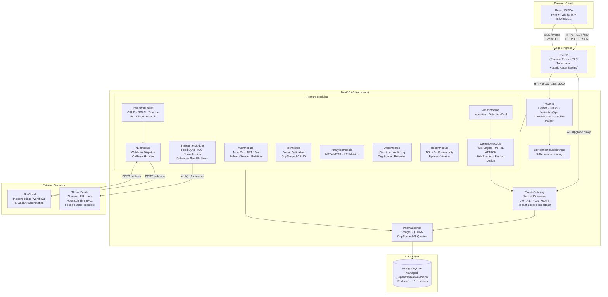
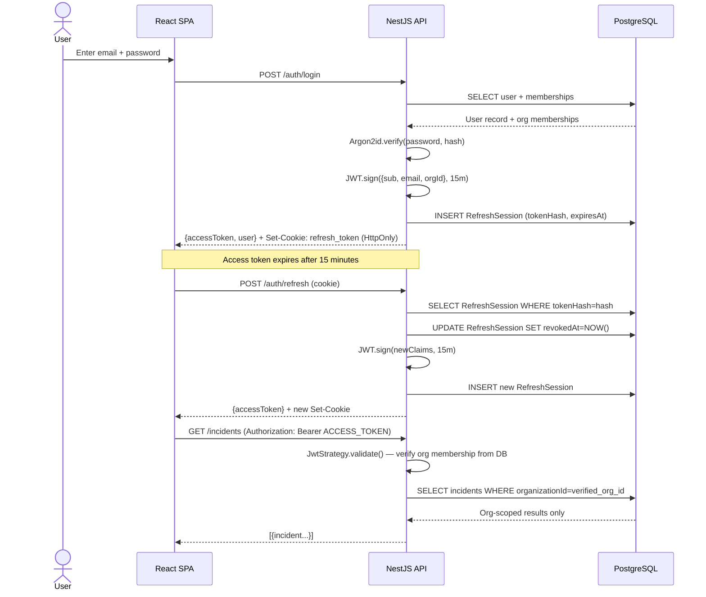
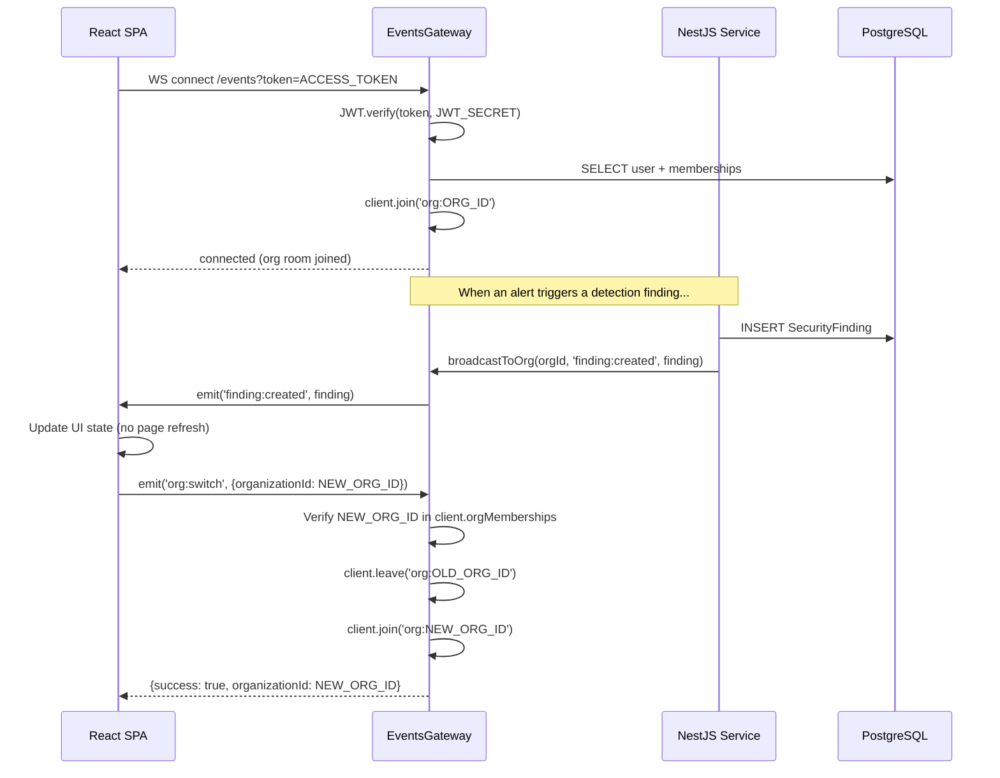
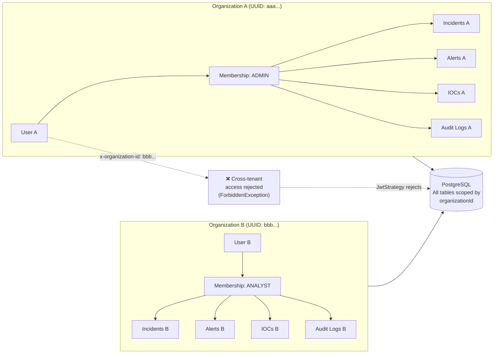

# SentinelFlow — Architecture Diagram

## System Architecture

```mermaid
graph TB
    subgraph Client["Browser Client"]
        FE["React 18 SPA\n(Vite + TypeScript + TailwindCSS)"]
    end

    subgraph Edge["Edge / Ingress"]
        NGINX["NGINX\n(Reverse Proxy + TLS Termination\n+ Static Asset Serving)"]
    end

    subgraph API["NestJS API (apps/api)"]
        direction TB
        MAIN["main.ts\nHelmet · CORS · ValidationPipe\nThrottlerGuard · Cookie-Parser"]

        subgraph Modules["Feature Modules"]
            AUTH["AuthModule\nArgon2id · JWT 15m\nRefresh Session Rotation"]
            INCIDENTS["IncidentsModule\nCRUD · RBAC · Timeline\nn8n Triage Dispatch"]
            ALERTS["AlertsModule\nIngestion · Detection Eval"]
            DETECT["DetectionModule\nRule Engine · MITRE ATT&CK\nRisk Scoring · Finding Dedup"]
            INTEL["ThreatIntelModule\nFeed Sync · IOC Normalization\nDefensive Seed Fallback"]
            IOC["IocModule\nFormat Validation\nOrg-Scoped CRUD"]
            ANALYTICS["AnalyticsModule\nMTTA/MTTR · KPI Metrics"]
            AUDIT["AuditModule\nStructured Audit Log\nOrg-Scoped Retention"]
            HEALTH["HealthModule\nDB · n8n Connectivity\nUptime · Version"]
            N8N["N8nModule\nWebhook Dispatch\nCallback Handler"]
        end

        GW["EventsGateway\nSocket.IO /events\nJWT Auth · Org Rooms\nTenant-Scoped Broadcast"]
        PRISMA["PrismaService\nPostgreSQL ORM\nOrg-Scoped All Queries"]
        CORR["CorrelationIdMiddleware\nX-Request-Id tracing"]
    end

    subgraph Data["Data Layer"]
        DB[("PostgreSQL 16\nManaged (Supabase/Railway/Neon)\n12 Models · 15+ Indexes")]
    end

    subgraph External["External Services"]
        N8NCLOUD["n8n Cloud\nIncident Triage Workflows\nAI Analysis Automation"]
        FEEDS["Threat Feeds\nAbuse.ch URLhaus\nAbuse.ch ThreatFox\nFeodo Tracker Blocklist"]
    end

    FE -- "HTTPS REST /api/*\nHTTP/1.1 + JSON" --> NGINX
    FE -- "WSS /events\nSocket.IO" --> NGINX
    NGINX -- "HTTP proxy_pass :3000" --> MAIN
    NGINX -- "WS Upgrade proxy" --> GW

    MAIN --> Modules
    MAIN --> CORR
    ALERTS --> DETECT
    DETECT --> GW
    INCIDENTS --> N8N
    N8N -- "POST webhook" --> N8NCLOUD
    N8NCLOUD -- "POST callback" --> N8N
    INTEL -- "fetch() 10s timeout" --> FEEDS
    Modules --> PRISMA
    GW --> PRISMA
    PRISMA --> DB
```

---

## Authentication & Authorization Flow

```mermaid
sequenceDiagram
    actor User
    participant FE as React SPA
    participant API as NestJS API
    participant DB as PostgreSQL

    User->>FE: Enter email + password
    FE->>API: POST /auth/login
    API->>DB: SELECT user + memberships
    DB-->>API: User record + org memberships
    API->>API: Argon2id.verify(password, hash)
    API->>API: JWT.sign({sub, email, orgId}, 15m)
    API->>DB: INSERT RefreshSession (tokenHash, expiresAt)
    API-->>FE: {accessToken, user} + Set-Cookie: refresh_token (HttpOnly)

    Note over FE,API: Access token expires after 15 minutes

    FE->>API: POST /auth/refresh (cookie)
    API->>DB: SELECT RefreshSession WHERE tokenHash=hash
    API->>DB: UPDATE RefreshSession SET revokedAt=NOW()
    API->>API: JWT.sign(newClaims, 15m)
    API->>DB: INSERT new RefreshSession
    API-->>FE: {accessToken} + new Set-Cookie

    FE->>API: GET /incidents (Authorization: Bearer ACCESS_TOKEN)
    API->>API: JwtStrategy.validate() — verify org membership from DB
    API->>DB: SELECT incidents WHERE organizationId=verified_org_id
    DB-->>API: Org-scoped results only
    API-->>FE: [{incident...}]
```

---

## WebSocket Real-Time Event Flow

```mermaid
sequenceDiagram
    participant FE as React SPA
    participant GW as EventsGateway
    participant API as NestJS Service
    participant DB as PostgreSQL

    FE->>GW: WS connect /events?token=ACCESS_TOKEN
    GW->>GW: JWT.verify(token, JWT_SECRET)
    GW->>DB: SELECT user + memberships
    GW->>GW: client.join('org:ORG_ID')
    GW-->>FE: connected (org room joined)

    Note over API,GW: When an alert triggers a detection finding...

    API->>DB: INSERT SecurityFinding
    API->>GW: broadcastToOrg(orgId, 'finding:created', finding)
    GW->>FE: emit('finding:created', finding)
    FE->>FE: Update UI state (no page refresh)

    FE->>GW: emit('org:switch', {organizationId: NEW_ORG_ID})
    GW->>GW: Verify NEW_ORG_ID in client.orgMemberships
    GW->>GW: client.leave('org:OLD_ORG_ID')
    GW->>GW: client.join('org:NEW_ORG_ID')
    GW-->>FE: {success: true, organizationId: NEW_ORG_ID}
```

---

## Tenant Isolation Model

```mermaid
graph LR
    subgraph OrgA["Organization A (UUID: aaa...)"]
        UA[User A] --> MA[Membership: ADMIN]
        MA --> IA[Incidents A]
        MA --> ALA[Alerts A]
        MA --> IOA[IOCs A]
        MA --> AUDA[Audit Logs A]
    end

    subgraph OrgB["Organization B (UUID: bbb...)"]
        UB[User B] --> MB[Membership: ANALYST]
        MB --> IB[Incidents B]
        MB --> ALB[Alerts B]
        MB --> IOB[IOCs B]
        MB --> AUDB[Audit Logs B]
    end

    DB[("PostgreSQL\nAll tables scoped by\norganizationId")]

    OrgA --> DB
    OrgB --> DB

    X["❌ Cross-tenant\naccess rejected\n(ForbiddenException)"]
    UA -.->|"x-organization-id: bbb..."| X
    X -.->|"JwtStrategy rejects"| DB
```
